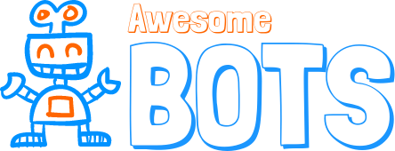

  

 
 

  

Table of Contents
-----------------

- [Platform Documentation](#platform-documentation)
- [Tools For Building Bots](#tools-for-building-bots)
- [Tools For Bot Analytics](#tools-for-bot-analytics)
- [Tools For Bot Conversation Mockups](#tools-for-bot-conversation-mockups)
- [Libraries](#libraries)
- [Bot Stores](#bot-stores)
- [Tutorials](#tutorials)
- [Communities](#communities)
- [Developers](#developers)
- [Testing](#testing)

## Platform Documentation
* [IBM Bot Asset Exchange](https://developer.ibm.com/code/exchanges/bots/)
* [Facebook messenger](https://developers.facebook.com/products/messenger/)
* [Slack](https://api.slack.com/bot-users)
* [Discord](https://blog.discordapp.com/the-robot-revolution-has-unofficially-begun/)
* [Telegram](https://core.telegram.org/bots/api)
* [Kik](https://dev.kik.com/#/home)
* [Zulip](https://zulip.com/integrations/)
* [HipChat](https://developer.atlassian.com/hipchat/getting-started)
* [Skype](https://developer.microsoft.com/en-us/skype/bots)
* [Cisco Spark](https://developer.ciscospark.com/getting-started.html)
* [Microsoft Bot Framework](https://dev.botframework.com/)
* [WeChat](https://admin.wechat.com/)
* [VKontakte](https://new.vk.com/dev/bizmessages)
* [Hangouts Chat](https://developers.google.com/hangouts/chat/concepts/)

## Tools For Building Bots
* [wit.ai ](https://wit.ai/) - Easily create text or voice based bots that humans can chat with.
* [Botkit](https://howdy.ai/botkit/) - Botkit eases the process of designing and running bots that live inside Slack.
* [Dialogflow](https://dialogflow.com/) - Build natural and rich conversational experiences.
* [Text It](https://textit.in/) - Visually build SMS and voice apps to engage your customers.
* [Chatfuel](https://chatfuel.com/) - The intuitive bot builder with AI navigation. No coding required.
* [Watson](http://www.ibm.com/cloud-computing/bluemix/watson/) - Bring the power of cognitive computing to your apps.
* [Beep Boop](https://beepboophq.com/) - Beep Boop is a simple hosting platform for your Slack and Messenger bots.
* [Dexter](https://rundexter.com/app/spreadsheet-bot) - Get a Slack bot that responds with answers from your own Google Sheet.
* [Converse AI](http://www.converse.ai/) - Respond to customer questions instantly with intelligent chatbot technology.
* [Gupshup](https://www.gupshup.io/developer/home) - Easiest & fastest way to build & deploy your bots on any channel.
* [Haven OnDemand](https://dev.havenondemand.com/apis) - They are similar APIs as that of watson, but far well documented   and have a freemium version.
* [Recast.AI](https://recast.ai) - Collaborative Bot Platform for developers: build conversational bots easily.
* [ChatterBot](https://github.com/gunthercox/ChatterBot) - Machine-learning based conversational dialog engine build in Python
* [Google Cloud Platform](https://cloud.google.com/natural-language) - Use sentiment analysis on a block of text to add decision tree logic for a conversation bot.
* [Messenger Demo Viewer](https://messenger-demo-viewer.kilianvalkhof.com/) - Demo FB Messenger bots without showing personal chats
* [BotStar](https://www.botstar.com/) - Powerful platform for designing & developing chatbots visually with smart training.

## Tools For Bot Analytics
* [ChatMetrics](https://chatmetrics.io/) - Engagement platform for bots. ChatMetrics allows to reactivate inactive users and improve retention by sending "smart" notifications to users.
* [Dialog](https://dialoganalytics.com/) - Chatbot analytics platform for marketers to drive user engagement, retention, conversion and understand behavior.
* [Dashbot](https://www.dashbot.io/) - Actionable Bot Analytics: Increase user engagement, acquisition, and monetization.
* [Botmetrics](https://www.getbotmetrics.com/) - Grow and retain your chatbot customers. Enterprise grade opensource conversational analytics, marketing automation, and CRM rolled into a single snippet of code.

## Tools For Bot Conversation Mockups
* [Bot Society](https://www.botsociety.io) - Bot conversation Mockups for presentation and demo.
* [Bot Sketch](https://dribbble.com/shots/2674603-Facebook-Messenger-UI-Kit-for-Chatbots-Sketch) - Sketch Chatbot UI (Mac Only)
* [Botframe](https://botframe.com) - a playground to design bots (conversation mockups).
* [Botmock](https://botmock.com) - Create conversation flows and interactive prototypes from a simple drag and drop editor, then share or test those prototypes and get feedback in one centralized location.
* [BotStar](https://www.botstar.com) - A fullfledged chatbot platform but the visual editor can be used as a mockup tool as well.

## Libraries

### General
* [Qtypes](https://github.com/superscriptjs/qtypes) - Rule based Answer Type classification system in Node.js.
* [BotKit](https://github.com/howdyai/botkit) - Botkit is a toolkit for making bot applications.
* [Claudia Bot Builder](https://github.com/claudiajs/claudia-bot-builder) - Create chat bots for FB, Slack, Skype and Telegram and deploy to AWS Lambda in minutes.
* [Universal Bot Framework](https://bitbucket.org/phips28/universal-bot-framework/overview) - Create crossplatform chat bots for FB Messenger, Kik, Telegram and Skype with just one logic.
* [Pandorabots](http://www.pandorabots.com/) - web service for building and deploying chatbots.
* [Microsoft Bot Framework](http://docs.botframework.com) - Node.js/.NET library for building, connecting, testing, and deploying powerful and intelligent bots. 
* [Bottender](https://github.com/Yoctol/bottender) - Make Bots in Your Way, Fast and Flexibly.
* [BotMan](https://github.com/botman/botman) - PHP Bot Framework supporting over a dozen platforms (FB, Instagram, MS Bot Framework, etc)

### Facebook Messenger
* [Node.js](https://github.com/Yoctol/messaging-apis/tree/master/packages/messaging-api-messenger)
* [Go](https://github.com/paked/messenger)

### Slack
* [Node.js (Official)](https://github.com/slackhq/node-slack-sdk)
* [Node.js](https://github.com/Yoctol/messaging-apis/tree/master/packages/messaging-api-slack)
* [Python (Official)](https://github.com/slackhq/python-slackclient)
* [Relax (scalable RTM library to scale to 1000's of teams)](https://github.com/zerobotlabs/relax)

### Telegram
* [Node.js](https://github.com/yagop/node-telegram-bot-api)
* [Node.js](https://github.com/telegraf/telegraf)
* [Node.js](https://github.com/Yoctol/messaging-apis/tree/master/packages/messaging-api-telegram)
* [PHP](https://github.com/irazasyed/telegram-bot-sdk)
* [PHP](https://github.com/php-telegram-bot/core)
* [Python](https://github.com/python-telegram-bot/python-telegram-bot)
* [C#](https://github.com/MrRoundRobin/telegram.bot)
* [Go](https://github.com/tucnak/telebot)
* [Java](https://github.com/pengrad/java-telegram-bot-api)

### Discord
###### Node.js
* [Eris](https://github.com/abalabahaha/eris)
* [Discord.js](https://github.com/hydrabolt/discord.js)
* [Discordie](https://github.com/qeled/discordie)
* [Discord.io](https://github.com/izy521/discord.io)

###### C#
* [Discord.Net](https://github.com/RogueException/Discord.Net)
* [DSharpPlus](https://github.com/NaamloosDT/DSharpPlus)

###### Python
* [discord.py](https://github.com/Rapptz/discord.py)

###### Java
* [JDA](https://github.com/DV8FromTheWorld/JDA/)

###### Rust
* [Serenity](https://github.com/zeyla/serenity)

###### Lua
* [Discordia](https://github.com/SinisterRectus/Discordia)

###### Go
* [Discordgo](https://github.com/bwmarrin/discordgo)

### Kik
* [Python](https://github.com/kikinteractive/kik-python)
* [Node.JS](https://github.com/kikinteractive/kik-node)

## Bot Stores
* [There is a bot for that](https://thereisabotforthat.com) - Search engine for bots
* [ChatBottle](https://chatbottle.co/) - Chatbots search engine
* [BotList](https://botlist.co/) - An App Store For Bots.
* [Slack Store](https://slack.com/apps) - The official Slack bot store.
* [Telegram Store](https://storebot.me/) - The unofficial Telegram bot store.
* [Product Hunt](https://www.producthunt.com/topics/bots) - Product Hunt bot list.
* [Dashbot](http://www.dashbot.io/bots) - Dashbot bot directory.
* [Skype Bot Directory](https://bots.botframework.com/) - The official list of skype bots by Microsoft Bot Framework
* [Teamchat](http://www.teamchat.com/en/bot-store/) - Bot store by teamchat.
* [Discord Bots](https://bots.discord.pw/) - An unofficial list of discord bots.
* [Discord Bot List](https://discordbots.org/) - An unofficial list of discord bots.
* [Telegram Botlist](https://t.me/botlist) - A bot list for Telegram.
* [Mayo Bot List](https://botlist.space/) - An unofficial list of discord bots.
* [Terminal Bot List](https://ls.terminal.ink/) - An unofficial list of discord bots.

## Tutorials
* [The Complete Beginner’s Guide To Chatbots](https://chatbotsmagazine.com/the-complete-beginner-s-guide-to-chatbots-8280b7b906ca).
* [The Secret To Making Your Own Facebook Messenger Bot In Less Than 15 Minutes.](https://chatbotsmagazine.com/have-15-minutes-create-your-own-facebook-messenger-bot-481a7db54892)
* [How to create a chatbot without coding a single line](https://chatbotsmagazine.com/how-to-create-a-chatbot-without-coding-a-single-line-e716840c7245#.kimh0igkz)
* [How To Build Bots for Messenger.](https://developers.facebook.com/blog/post/2016/04/12/bots-for-messenger/)
* [Creating A Chat Bot.](https://medium.freecodecamp.com/creating-a-chat-bot-42861e6a2acd#.32hmkqfq7)
* [A Beginner’s Guide To Your First Bot.](https://slackhq.com/a-beginners-guide-to-your-first-bot)
* [Pair Programming a Facebook Messenger Bot.](https://www.youtube.com/watch?v=zFO1cRr5-qY)
* [Facebook Chatbot Tutorial](https://github.com/AdrianKrebs/facebook-chatbot-tutorial)
* [Design Framework For Chatbots](https://chatbotsmagazine.com/design-framework-for-chatbots-aa27060c4ea3)
* [UX of Chatbots](http://uxofchatbots.com/)

## Communities
* [Bots](https://www.facebook.com/groups/chatbot/) - Facebook group.
* [UX for Bots](https://www.facebook.com/groups/uxforbots/) - Facebook group.
* [Chat Bot Magazine](https://chatbotsmagazine.com/) - Medium.
* [HH Bots](https://www.facebook.com/groups/hhbots/) - Facebook group.
* [Messenger Platform Developer Community](https://www.facebook.com/groups/242384196138564/) - Official Facebook group.
* [Chatbots and Conversational Agents](https://www.quora.com/topic/Chatbots-and-Conversational-Agents) - Quora Topic
* [Bot Developer Hangouts](http://dev4slack.xoxco.com/) - Community on Slack for all bot platforms.
* [BotList Chat](http://t.me/botlistchat) - Telegram group.
* [Bot Development](http://t.me/botdevelopment) - Telegram group.

## Conferences
* [ChatbotConf](https://chatbotconf.com/)
* [Talkabot](https://talkabot.ai/)

## Developers
* [BotMakers](https://botmakers.net/) - The best place to hire chatbot developers
* [Botgig](http://www.botgig.com/) - Hire a top chatbot dev from a vetted talent pool.

## Testing
* [ChatbotTest](http://chatbottest.com/) - Chatbottest is an open source guide that helps you identify chatbot's design issues under 7 different categories.
* [BotTesting](http://bottesting.co/) - Test your bot! Send your email and bot link to us, we’ll examine your bot’s performance and usability

## License

To the extent possible under law, [Vishnu Ks](http://www.vishnuks.com) has waived all copyright and related or neighboring rights to this work.
